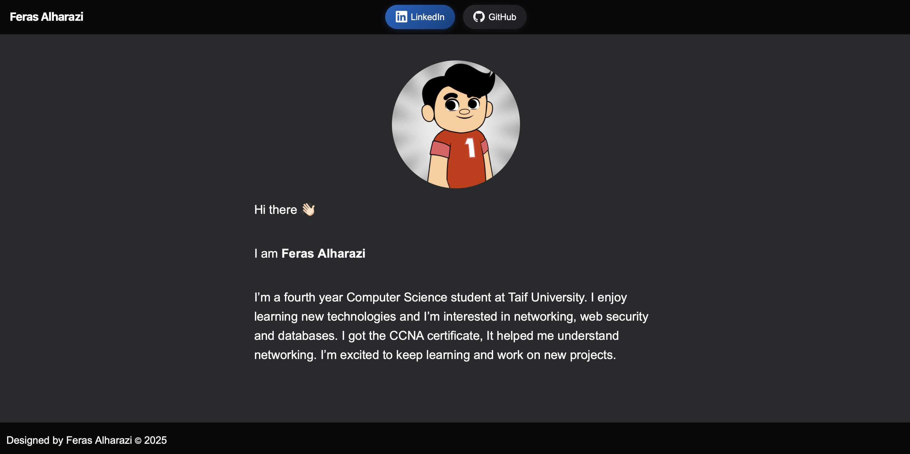

# Personal Web Page

This is a simple personal web page built with HTML and CSS.  
It showcases basic information about me, and links to my LinkedIn and GitHub profiles.

## Preview

The page displays:
- My name and a Avatar image
- A short introduction about me 
- Quick access buttons to:
  - [LinkedIn](https://www.linkedin.com/in/ferasharazi/)
  - [GitHub](https://github.com/ferasharazi)

## Project Structure

- `index.html` – Main HTML file
- `style.css` – Styling
- `avatar-image.jpg` – Avatar image
  
## Screenshot

